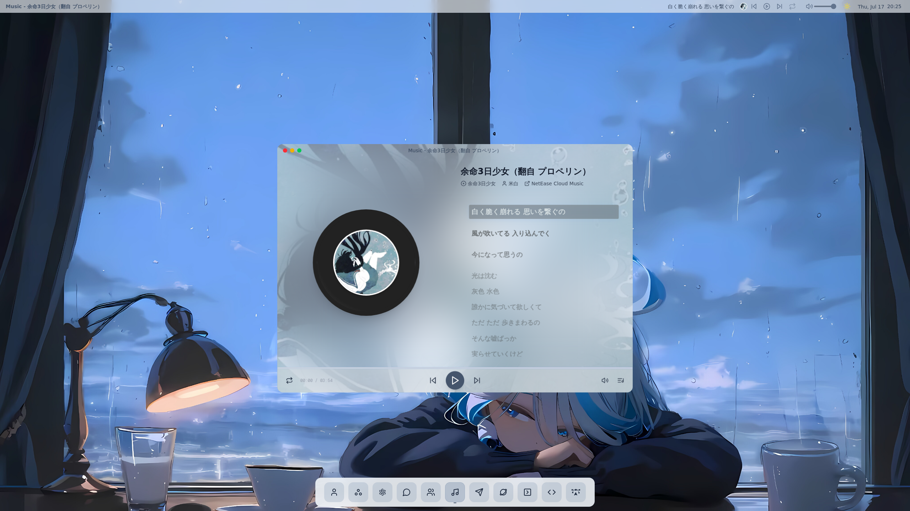
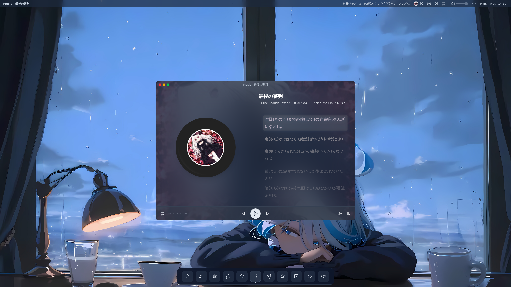

# Snowykami's 的首页

这是一个由Next.js（https://nextjs.org）创建的项目，使用了[`create-next-app`](https://nextjs.org/docs/app/api-reference/cli/create-next-app)。

仿照macOS界面的风格制作的个人主页。

## 预览

<!-- START_PREVIEW_IMAGE -->


<!-- END_PREVIEW_IMAGE -->

## 开始

启动开发服务器：

```bash
npm run dev
# or
yarn dev
# or
pnpm dev
# or
bun dev
```

打开 [http://localhost:3000](http://localhost:3000) 在浏览器中查看结果。

## 构建

项目使用了静态构建，构建好后可以部署到任何静态文件服务器上。（单页应用）

```bash
npm run build

pnpm build

yarn build

bun build
```

## 其他

这个项目最初由vercel v0生成并完成基础组件，后续由作者本人进行修改和完善。