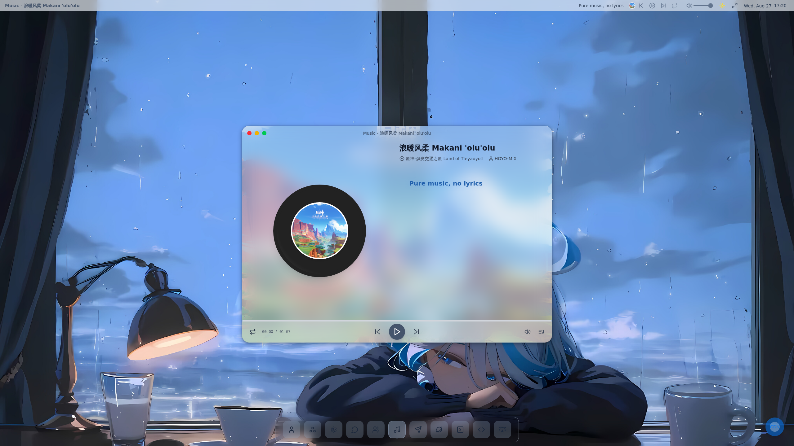
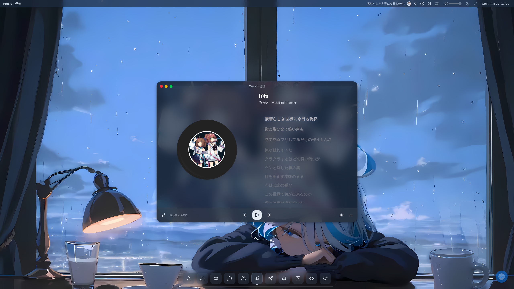

This is a [Next.js](https://nextjs.org) project bootstrapped with [`create-next-app`](https://nextjs.org/docs/app/api-reference/cli/create-next-app).

这是一个个人主页，仿照macOS桌面制作，拥有窗口调度，全局命令注册，音乐，个人信息/项目/联系方式/友链展示等功能，拥有非常奇妙的交互体验非常多的bugs

## features

### 功能列表

- [x] 个人信息展示窗口: 支持个人头像、昵称、简介等信息展示
- [x] 项目信息展示窗口: 支持个人项目名称、描述、链接等信息展示
- [x] 联系方式展示窗口: 支持个人联系方式展示，支持复制功能
- [x] 友链展示窗口: 支持个人友链展示，支持复制功能，支持基于GitHub Issue模板的友链提交
- [x] 项目展示页: 支持项目名称、描述、链接等信息展示，支持项目分类
- [x] 音乐: 全局音乐上下文。支持网易云音乐、QQ音乐、酷狗音乐等音乐平台解析，支持绝大部分音频控制功能，歌词展示，音频播放列表等
- [x] 窗口调度: 支持窗口拖拽、缩放、最小化、最大化、关闭等操作，层级管理
- [x] 终端命令: 全局命令上下文、支持全局快捷键注册，支持自定义命令，支持组件命令，都可以在终端进行使用
- [x] 外观适配: 支持浅色模式和深色模式切换，支持自定义主题，支持

### 扩展功能

- [x] 自定义应用注册功能
- [x] 自定义窗口

...更多请自行探索

## Preview

light mode

dark mode


## Getting Started

First, run the development server:

```bash
npm run dev
# or
yarn dev
# or
pnpm dev
# or
bun dev
```

Open [http://localhost:3000](http://localhost:3000) with your browser to see the result.

You can start editing the page by modifying `app/page.tsx`. The page auto-updates as you edit the file.

This project uses [`next/font`](https://nextjs.org/docs/app/building-your-application/optimizing/fonts) to automatically optimize and load [Geist](https://vercel.com/font), a new font family for Vercel.

## Learn More

To learn more about Next.js, take a look at the following resources:

- [Next.js Documentation](https://nextjs.org/docs) - learn about Next.js features and API.
- [Learn Next.js](https://nextjs.org/learn) - an interactive Next.js tutorial.

You can check out [the Next.js GitHub repository](https://github.com/vercel/next.js) - your feedback and contributions are welcome!

## Deploy on Vercel

The easiest way to deploy your Next.js app is to use the [Vercel Platform](https://vercel.com/new?utm_medium=default-template&filter=next.js&utm_source=create-next-app&utm_campaign=create-next-app-readme) from the creators of Next.js.

Check out our [Next.js deployment documentation](https://nextjs.org/docs/app/building-your-application/deploying) for more details.
